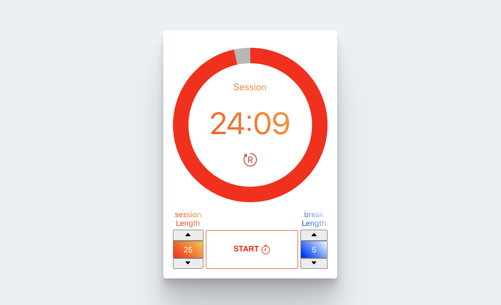

# FRONT END LIBRARIES PROJECT | BUILD A 25 + 5 (POMODORO) Clock

> This is the fifth project of _freeCodeCamp "Front End Libraries Projects" Certification_

## HOW TO USE

### 1. Install all dependencies: 
```bash
$ npm install
```

### 2. Run the project in dev mode:
```bash
$ npm start
```

### 3. Open Browser
Open [http://localhost:3000](http://localhost:3000) with your browser to see the result.


## Technology Stack

- **ReactJS**: frontend library (set up with [create-react-app](https://github.com/facebook/create-react-app))
- **SASS**: CSS pre-processors

## SUMMARY

You can use any mix of HTML, JavaScript, CSS, Bootstrap, SASS, React, Redux, and jQuery to complete this project. You should use a frontend framework (like React for example) because this section is about learning frontend frameworks. Happy coding!

### User Stories

|    US    |        Description        |
| :------- | :------------------------ |
| **#1**:  |  |
| **#2**:  |  |
| **#3**:  |  |
| **#4**:  |  |
| **#5**:  |  |
| **#6**:  |  |
| **#7**:  |  |
| **#8**:  |  |
| **#9**:  |  |
| **#10**: |  |
| **#11**: |  |
| **#12**: |  |
| **#13**: |  |
| **#14**: |  |
| **#15**: |  |